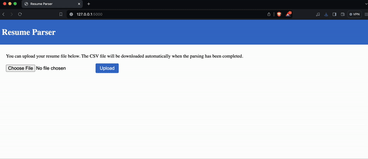

# Resume Parser

Submitted by: Sunil Prajapati

ID: st124073

### Description

Resume Parser is a tool to extract relevant information from an upload pdf resume file and return a csv file with the extracted information. The current information that parser tries to extract are:

    - email
    - contact
    - skills
    - experience (job titles)

Currently the job titles are well extracted for computer science fields such as Software Engineer, Full Stack Engineer etc. All the skills and job titles for references are stored in skills.jsonl file in data folder.

### Repo Strcture
<pre>
root
|--<a href="https://github.com/scherbatsky-jr/nlp-text-generator/blob/main/LSTM_LM.ipyng">resume-parser.ipynb</a>
|--<a href="https://github.com/scherbatsky-jr/nlp-text-generator/blob/main/app">app</a>
|    |--<a href="https://github.com/scherbatsky-jr/nlp-text-generator/blob/main/app/static">static</a>
|    |--<a>templates</a>
|    |   |--<a href="https://github.com/scherbatsky-jr/nlp-text-generator/blob/main/app/templates/index.html">index.html</a>
|    |
|    |--<a href="https://github.com/scherbatsky-jr/nlp-text-generator/blob/main/app/app.py">app.py</a>
|
|--<a>data</a>
   |--<a>skills.jsonl</a>
</pre>

### Running the app

Go to the app directory:

`cd app`

To run the flask app, run the command

`python3 main.py`

The app will be available at: http://localhost:5000

### Demo

